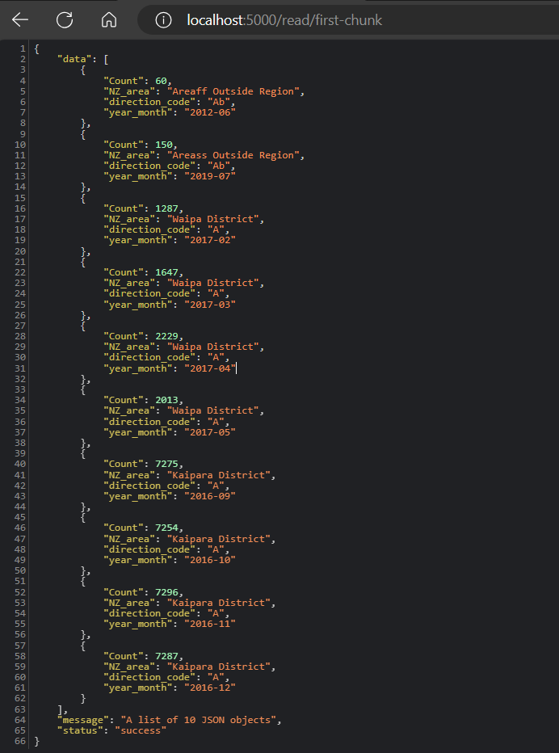
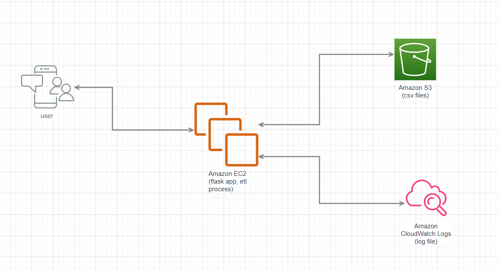

## Table of Contents

- [Table of Contents](#table-of-contents)
- [Overview](#overview)
- [Getting Started](#getting-started)
  - [Prerequisites](#prerequisites)
  - [Installation](#installation)
- [Usage](#usage)
- [API Output](#api-output)
- [System diagram (AWS)](#system-diagram-aws)
- [Logging](#logging)

## Overview

Simple ETL “Extract – Transform – Load” pipeline that ingests 1 or multiple CSV files into a Database.

- It starts by Extracting data from CSV files in the csv_files folder, concatenate them into one dataframe and then store the output into sqlalchemy.
- the endpoint “/read/first-chunk“ will output the first 10 lines from the Database


## Getting Started

### Prerequisites

Ensure you have the following installed:
- Python 3.x
- Pip (Python package installer)

### Installation

1. Clone the repository:

   ```bash
   git clone git@github.com:ghanmi-hamza/simple_etl_project.git
   ```
2. Navigate to the project directory:
    ```bash
   cd project_path
   ```
3. Install dependencies:
    ```bash
   pip install -r requirements.txt
   ```

## Usage

1. To run the Flask app, execute the following command:

    ```bash
   python main.py
   ```
2. The endpoint that returns the first 10 lines from Database (sqlalchemy) will be accessible at http://localhost:5000/read/first-chunk.

## API Output



##  System diagram (AWS)
Here the system diagram of the solution deployed to AWS



## Logging
  a file contains logs called etl.log will be generated

